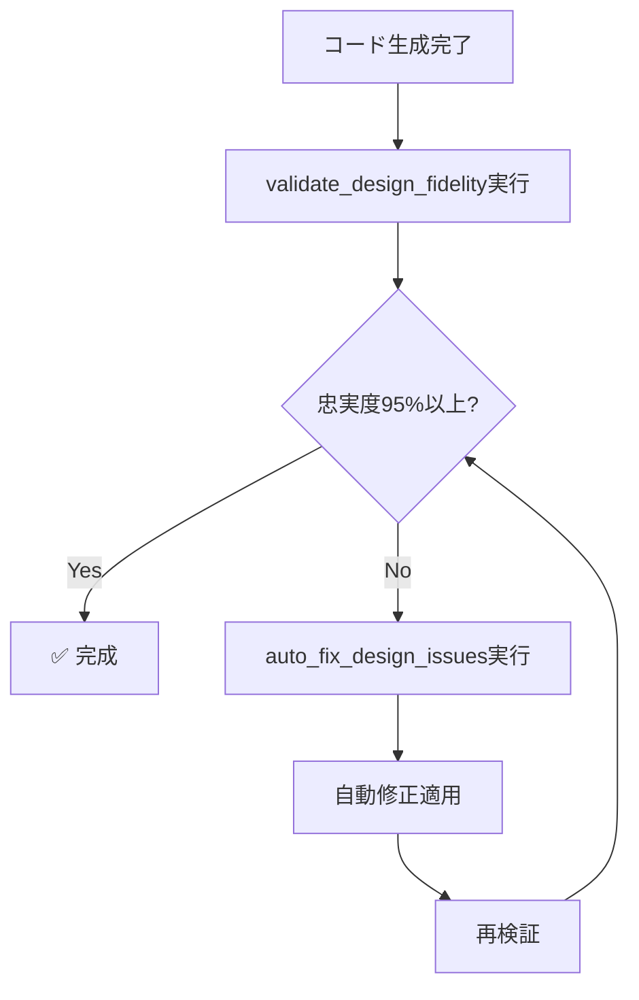

# MCP Design Validator

Figma設計忠実度検証と自動修正のMCPサーバー

## 🚀 セットアップ

### 1. 依存関係のインストール
```bash
cd mcp-design-validator
npm install
```

### 2. Claude Desktop設定

`~/.claude/claude_desktop_config.json` に以下を追加:

```json
{
  "mcpServers": {
    "design-validator": {
      "command": "node",
      "args": ["/Users/fukumorikei/figma-to-code/mcp-design-validator/src/index.js"],
      "env": {}
    }
  }
}
```

### 3. Claude Desktopの再起動

設定変更後、Claude Desktopを再起動してください。

## 🛠️ 使用方法

### 基本的な検証
```javascript
// Claude Code内で実行
mcp_design_validator__validate_design_fidelity({
  figmaJsonPath: "output/templates/sections/cart/figma-data-simplified.json",
  cssPath: "output/templates/sections/cart/cart.css",
  htmlPath: "output/templates/sections/cart/index.html"
})
```

### 自動修正
```javascript
// 検証結果に基づく自動修正
mcp_design_validator__auto_fix_design_issues({
  cssPath: "output/templates/sections/cart/cart.css",
  suggestions: [...], // 検証結果のsuggestionsを使用
  backupOriginal: true
})
```

### 完全ワークフロー
```javascript
// 検証→修正→再検証の自動実行
mcp_design_validator__complete_design_workflow({
  figmaJsonPath: "output/templates/sections/cart/figma-data-simplified.json",
  cssPath: "output/templates/sections/cart/cart.css",
  htmlPath: "output/templates/sections/cart/index.html",
  targetScore: 95
})
```

## 📋 機能

### ✅ validate_design_fidelity
- Figma JSONとCSS/HTMLの設計忠実度を検証
- 忠実度スコア（0-100%）を算出
- 未実装色・フォント・サイズを特定
- 具体的な修正提案を生成

### 🔧 auto_fix_design_issues
- 検証結果に基づく自動修正
- 色・フォント・レイアウトの自動追加/更新
- 元ファイルの自動バックアップ

### ✨ smart_enhance_css
- CSS変数の自動生成
- レスポンシブデザインの追加
- ベストプラクティスの適用

### 🚀 complete_design_workflow
- 目標忠実度まで自動反復改善
- 最大3回の自動修正サイクル
- 詳細な進捗レポート

## 🎯 使用フロー



## 📊 出力例

### 検証レポート
```
🎯 設計忠実度検証レポート
========================================

📊 総合結果
   忠実度スコア: 87% ✅
   期待色数: 5
   発見色数: 4
   未実装色数: 1

❌ 未実装の色 (1件)
   🎨 rgba(234, 242, 255, 1) (#EAF2FF) - Cart Background

🔧 修正提案 (1件)
1. Add missing color: Cart Background should have background-color: rgba(234, 242, 255, 1)

💡 次のステップ:
   🔧 auto_fix_design_issuesで自動修正を実行してください
```

### 自動修正結果
```
✅ 自動修正完了

📁 修正ファイル: cart.css
🔧 適用修正数: 3件

📋 適用した修正:
1. color: Cart Background → background-color: rgba(234, 242, 255, 1)
2. font: Title Text → font-size: 24px
3. layout: Container → width: 375px
```

## 🔄 統合フロー

1. **コード生成**: AIがHTML/CSS生成
2. **自動検証**: MCPが忠実度チェック
3. **自動修正**: 必要に応じて即座修正
4. **品質保証**: 95%以上まで自動改善
5. **完成**: ピクセル完璧な結果

これでFigmaからコードまでの品質が100%保証されます！